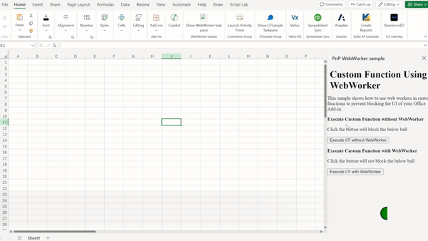

# Custom function sample using web worker



This sample shows how to use web workers in custom functions to prevent blocking the UI of your Office Add-in.

## Features

- Custom Functions
- Web workers

## How to Run this sample

## Prerequisites

To learn more about custom functions, see [Create custom functions in Excel](https://learn.microsoft.com/office/dev/add-ins/excel/custom-functions-overview). See [Custom Functions requirement sets](https://learn.microsoft.com/office/dev/add-ins/reference/requirement-sets/custom-functions-requirement-sets) for a list of the platforms that support custom functions.

### Run and debug the add-in
1. Open M365/Teams Toolkit
<br>
2. Click `Check and Install Dependencies`
3. Launch and debug
    * **For Office on Windows/macOS**, click `Preview Your Office Add-in(F5)` button on tree view and select a launch config. A Word/Excel/PowerPoint app will launch with add-in sample side-loaded. **Note:** Debugging on macOS is not supported yet.
    * **For Office on the web**: [Sideload Office Add-ins to Office on the web](https://learn.microsoft.com/office/dev/add-ins/testing/sideload-office-add-ins-for-testing)
4. Click `Stop Preview Your Office Add-in` to stop debugging.

### How to use this sample

After launch Word/Excel/PowerPoint  with add-in sample side-loaded, follow below steps:
1. Click the executeCFWithoutWebWorker button, a CustomFunction without WebWorker will be instered into the 'A1' Cell and executed, and the ball inside the taskpane will be blocked.
2. Click the executeCFWithWebWorker button, a CustomFunction with WebWorker will be instered into the 'A1' Cell and executed, and the ball inside the taskpane will not be blocked.

Now you can use the following custom functions:

```
=WebWorkerSample.TEST(2)
=WebWorkerSample.TEST_PROMISE(2)
=WebWorkerSample.TEST_ERROR(2)
=WebWorkerSample.TEST_ERROR_PROMISE(2)
=WebWorkerSample.TEST_UI_THREAD(2)
```

If you open the task pane you will see an animated bouncing ball. You can see the effect of blocking the UI thread by entering `=WebWorkerSample.TEST_UI_THREAD(50000)` into a cell. The bouncing ball will stop for a few seconds while the result is calculated.

### File structure
(DELETE) Use copilot chat @workspace to generate folder structure
```
| .eslintrc.json
| .gitignore
| .vscode/
|   | extensions.json
|   | launch.json               Launch and debug configurations
|   | settings.json             
|   | tasks.json                
| assets/                       Static assets like image/gif
| babel.config.json
| manifest*.xml                 Manifest file
| package.json                  
| README.md                     Get started here
| teamsapp.yml                  Config file for M365/Teams Toolkit support
| SECURITY.md
| src/                          Add-ins source code
|   | commands/
|   |   | commands.html
|   |   | commands.js
|   | taskpane/
|   |   | taskpane.html         Taskpane entry html
|   |   | taskpane.js           Add API calls and logic here
|   | functions/
|   |   | functions.js          custom function js
|   |   | functions-worker.js   webworker js
| webpack.config.js             Webpack config
```

## Feedback
Did you experience any problems with the sample? [Create an issue]( https://github.com/OfficeDev/Office-Samples/issues/new) and we'll help you out.

## Copyright
Copyright (c) 2024 Microsoft Corporation. All rights reserved.
This project has adopted the [Microsoft Open Source Code of Conduct](https://opensource.microsoft.com/codeofconduct/). For more information, see the [Code of Conduct FAQ](https://opensource.microsoft.com/codeofconduct/faq/) or contact [opencode@microsoft.com](mailto:opencode@microsoft.com) with any additional questions or comments.
<br>**Note**: The taskpane.html file contains an image URL that tracks diagnostic data for this sample add-in. Please remove the image tag if you reuse this sample in your own code project.


## Disclaimer

**THIS CODE IS PROVIDED _AS IS_ WITHOUT WARRANTY OF ANY KIND, EITHER EXPRESS OR IMPLIED, INCLUDING ANY IMPLIED WARRANTIES OF FITNESS FOR A PARTICULAR PURPOSE, MERCHANTABILITY, OR NON-INFRINGEMENT.**

## Details

### Dispatch to web worker

When a custom function needs to use a web worker, we turn the calculation into a job and dispatch it to a web worker. The **dispatchCalculationJob** function takes the function name and parameters from a custom function, and creates a job object that is posted to a web worker. For more details see the **dispatchCalculationJob** function in [functions.js](functions.js).

```JavaScript
    // Post a job to the web worker to do the calculation
    function dispatchCalculationJob(functionName, parameters) {
        const jobId = g_nextJobId++;
        return new Promise(function(resolve, reject) {
            // store the promise information.
            g_jobIdToPromiseInfoMap[jobId] = {resolve: resolve, reject: reject};
            const worker = getOrCreateWebWorker(jobId);
            worker.postMessage({
                jobId: jobId,
                name: functionName,
                parameters: parameters
            });
        });
    }
```

### Web worker runs the job and returns the result

The web worker runs the job specified in the job object to do the actual calculation. The web worker code is in a separate file in [functions-worker.js](functions-worker.js).

The functions-worker.js will:

1. Receive a message containing the job to run.
1. Invoke a function to perform the calculation.
1. Call **postMessage** to post the result back to the main thread.

```JavaScript
self.addEventListener('message',
    function(event) {
        let data = event.data;
        if (typeof(data) == "string") {
            data = JSON.parse(data);
        }

        const jobId = data.jobId;
        try {
            const result = invokeFunction(data.name, data.parameters);
            // check whether the result is a promise
            if (typeof(result) == "function" || typeof(result) == "object" && typeof(result.then) == "function") {
                result.then(function(realResult) {
                    postMessage(
                        {
                            jobId: jobId,
                            result: realResult
                        }
                    );
                })
                .catch(function(ex) {
                    postMessage(
                        {
                            jobId: jobId,
                            error: true
                        }
                    )
                });
            }
            else {
                postMessage({
                    jobId: jobId,
                    result: result
                });
            }
        }
        catch(ex) {
            postMessage({
                jobId: jobId,
                error: true
            });
        }
    }
);

```

Most of the previous code handles the error case and Promise case.

### Process results from the web worker

In [functions.js](functions.js), when a new web worker is created, it is provided a callback function to process the result. The callback function parses the data to determine the outcome of the job. It resolves or rejects the promise as determined by the job result data.

```JavaScript
        // create a new web worker
        const webWorker = new Worker("functions-worker.js");
        webWorker.addEventListener('message', function(event) {
            let data = event.data;
            if (typeof(data) == "string") {
                data = JSON.parse(data);
            }

            if (typeof(data.jobId) == "number") {
                const jobId = data.jobId;
                // get the promise info associated with the job id
                const promiseInfo = g_jobIdToPromiseInfoMap[jobId];
                if (promiseInfo) {
                    if (data.error) {
                        // The web worker returned an error
                        promiseInfo.reject(new Error());
                    }
                    else {
                        // The web worker returned a result
                        promiseInfo.resolve(data.result);
                    }
                    delete g_jobIdToPromiseInfoMap[jobId];
                }
            }
        });
```
