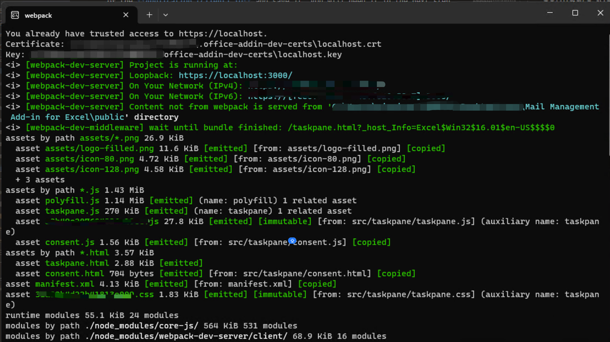
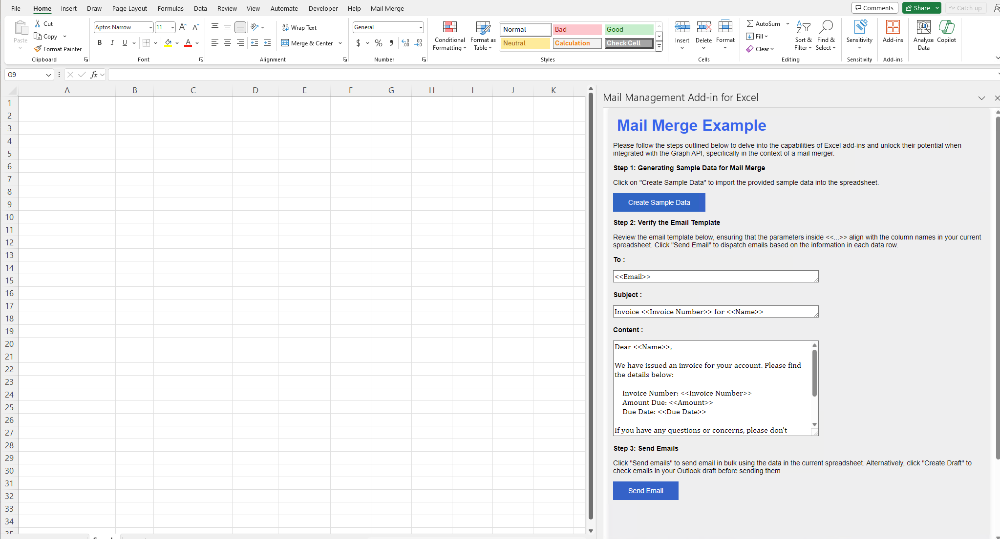
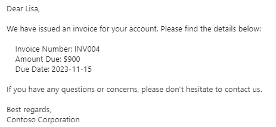

# Excel Mail Merge Sample Office Add-in


This sample demonstrates how to use the Microsoft Graph JavaScript SDK to send emails in Excel from Office Add-ins.

### Features
- Create Sample Data, including valid email address (required) and other information.
- Verify Template and Data, the To Line must contain the column name of the email address.
- Send Email, which will pop up a dialog to get the consent of Microsoft Graph. After sign-in, the email will be send out.

## How to Run this sample

### Prerequisites
To run the completed project in this folder, you need the following:
- [Node.js](https://nodejs.org) installed on your development machine. (**Note:** This tutorial was written with Node version 16.14.0. The steps in this guide may work with other versions, but that has not been tested.)
- Either a personal Microsoft account with a mailbox on Outlook.com, or a Microsoft work or school account. You can [sign up for the Microsoft 365 Developer Program](https://developer.microsoft.com/microsoft-365/dev-program) to get a free Microsoft 365 subscription.

### Register a web application with the Azure Active Directory admin center
1. If you have an application ID already, please ensure: 

- In [Microsoft Entra admin center](https://aad.portal.azure.com) under **Identity > Applications > App registrations**: 
- Navigate to **Redirect URI**, set the first drop-down to `Single-page application (SPA)` and its value to `https://localhost:3000/consent.html`.

2. Otherwise, if you haven't registered a web application with the Azure Active Directory admin center, please follow the steps below:

- Open a browser and navigate to the [Microsoft Entra admin center](https://aad.portal.azure.com). Login using a **personal account** (aka: Microsoft Account) or **Work or School Account**.

- Select **Identity** in the left-hand navigation, then select **App registrations** under **Applications**.
- Select **New registration**. On the **App registrations** page, set the values as follows.
    - Set **Name** to `Office Add-in Graph Tutorial`.
    - Set **Supported account types** to **Accounts in any organizational directory and personal Microsoft accounts**.
    - Under **Redirect URI**, set the first drop-down to `Single-page application (SPA)` and set the value to `https://localhost:3000/consent.html`.

- Select **Register**. On the **Office Add-in Graph Tutorial** page, copy the value of the **Application (client) ID** and save it, you will need it in the next step.


### Configure the sample

1. Edit the `taskpane.js` file and make the following changes.
    - Replace `YOUR_APP_ID_HERE` with the **Application Id** you got from the App Registration Portal.
1. In your command-line interface (CLI), navigate to this directory and run the following command to install requirements.
    ```
    npm install
    ```

### Run and debug the add-in
1. Open Teams Toolkit
<br>
2. Click `Check and Install Dependencies`
3. Launch and debug
    * **For Office on Windows/macOS**, click `Preview Your Office Add-in(F5)` button on tree view and select a launch config. A Word/Excel/PowerPoint app will launch with add-in sample side-loaded. **Note:** Debugging on macOS is not supported yet.
    * To debug in Desktop (Edge Legacy), make sure you have installed [Legacy Office Add-in Debugger](vscode:extension/msoffice.microsoft-office-add-in-debugger). For more details, go to [Debug Edge Legacy Webview](https://learn.microsoft.com/office/dev/add-ins/testing/debug-with-vs-extension)
    * **For Office on the web**: [Sideload Office Add-ins to Office on the web](https://learn.microsoft.com/office/dev/add-ins/testing/sideload-office-add-ins-for-testing)
4. Click `Stop Previewing Your Office Add-in` to stop debugging.

### How to use the sample

A webpack server will be hosted on https://localhost:3000/, as the CLI shows:



An Excel desktop application will be auto-launched and the Mail Merge Addin will be auto-run on the right taskpane area. The sideload steps has been integrated into the process, eliminating the need for manual intervention.



Please follow the steps below:

1. Create Sample Data, including valid email address (required) and other information.

2. Verify Template and Data, the To Line must contain the column name of the email address.

3. Send Email, which will pop up a dialog to get the consent of Microsoft Graph. After sign-in, the email will be send out.

    

### File structure
```
| .eslintrc.json
| .gitignore
| .vscode/
|   | extensions.json
|   | launch.json               Launch and debug configurations
|   | settings.json             
|   | tasks.json                
| assets/                       Static assets like image/gif
| babel.config.json
| manifest*.xml                 Manifest file
| package.json                  
| README.md                     Get started here
| SECURITY.md
| src/                          Add-ins source code
|   | commands/
|   |   | commands.html
|   |   | commands.js
|   | taskpane/
|   |   | taskpane.css          Taskpane style
|   |   | taskpane.html         Taskpane entry html
|   |   | taskpane.js           Add API calls and logic here
| webpack.config.js             Webpack config
```

## Feedback
Did you experience any problems with the sample? [Create an issue]( https://github.com/OfficeDev/Word-Scenario-based-Add-in-Samples/issues/new) and we'll help you out.

Let us know your experience using our sample code for Office add-in development: [Sample survey](https://aka.ms/OfficeDevSampleSurvey).

## Copyright
Copyright (c) 2021 Microsoft Corporation. All rights reserved.
This project has adopted the [Microsoft Open Source Code of Conduct](https://opensource.microsoft.com/codeofconduct/). For more information, see the [Code of Conduct FAQ](https://opensource.microsoft.com/codeofconduct/faq/) or contact [opencode@microsoft.com](mailto:opencode@microsoft.com) with any additional questions or comments.
<br>**Note**: The taskpane.html file contains an image URL that tracks diagnostic data for this sample add-in. Please remove the image tag if you reuse this sample in your own code project.


## Disclaimer
**THIS CODE IS PROVIDED *AS IS* WITHOUT WARRANTY OF ANY KIND, EITHER EXPRESS OR IMPLIED, INCLUDING ANY IMPLIED WARRANTIES OF FITNESS FOR A PARTICULAR PURPOSE, MERCHANTABILITY, OR NON-INFRINGEMENT.**
