# Getting Started with Teams App for Office add-in Sample

## This sample illustrates

- How an Office add-in can support Word, Excel, PowerPoint and Outlook Apps by using the unified JSON manifest.

## Prerequisites to use this sample
- [Node.js](https://nodejs.org) 16/18 (Tested on 16.14.0)
- Office connected to a Microsoft 365 subscription. If you don't already have Office, you might qualify for a Microsoft 365 E5 developer subscription through the [Microsoft 365 Developer Program](
https://developer.microsoft.com/en-us/microsoft-365/dev-program);
for details, see the [FAQ](
https://learn.microsoft.com/en-us/office/developer-program/microsoft-365-developer-program-faq#who-qualifies-for-a-microsoft-365-e5-developer-subscription-).
Alternatively, you can [sign up for a 1-month free trial](
https://www.microsoft.com/en-us/microsoft-365/try?rtc=1)
or [purchase a Microsoft 365 plan](
https://www.microsoft.com/en-us/microsoft-365/buy/compare-all-microsoft-365-products).
- [Registry-Key](https://aka.ms/teams-toolkit/office-addin/registry-key) (Please follow the README in the registry folder)
   - Click Registry link and will download a .zip.

       

   - Then operate the .bat file according to README.

       

- Environment variables (Please follow these steps)

   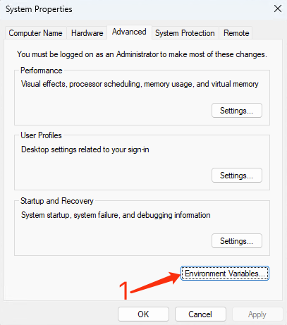

   

   TEAMSFX_OFFICE_ADDIN

   

   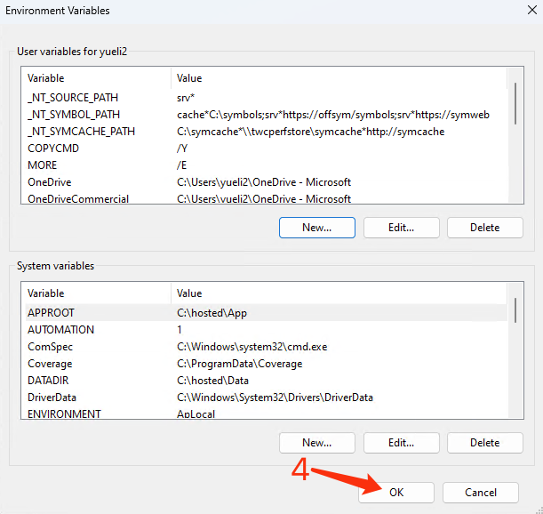


## Install Toolkit package in VS-Code
You need to reload your VS-Code after you have completed the following three steps.
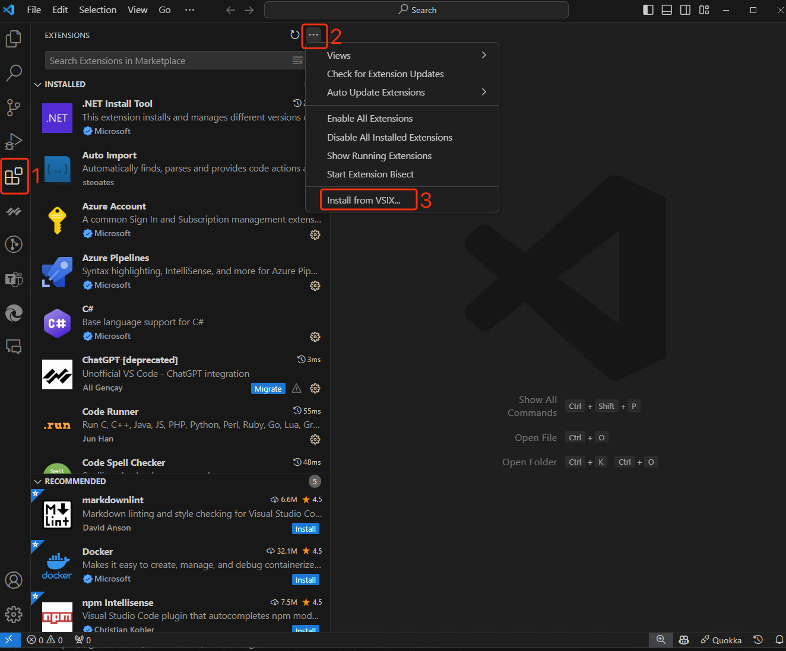

## Get your environment ready
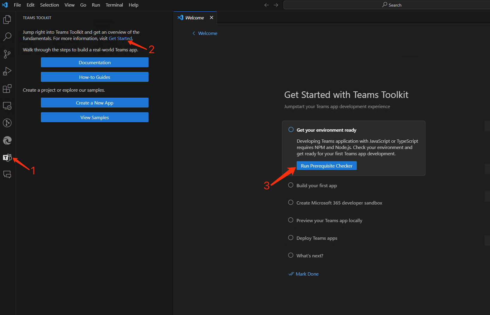

Please ensure your enviroment check is ready. As shown in the following picture. 
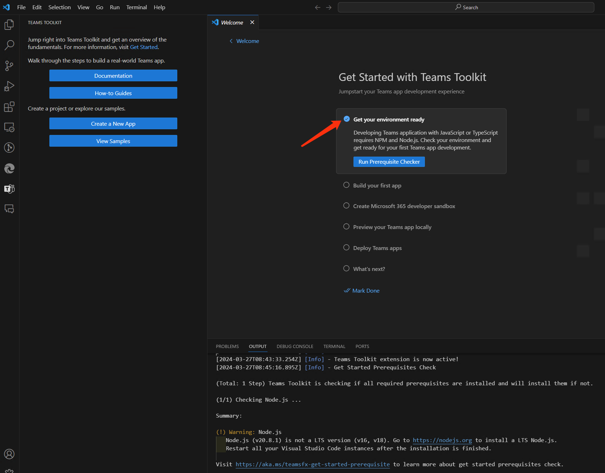

## Create Teams App for Office add-in
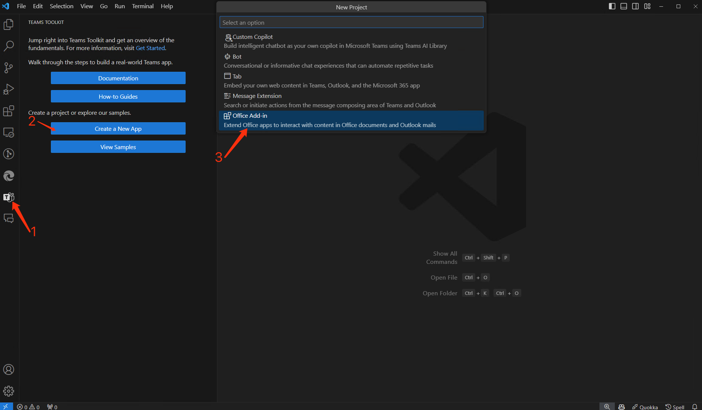

Example of an add-in project via toolkit.


## File structure
```
| .eslintrc.json
| .gitignore
| .vscode
|   | extensions.json
|   | launch.json              Launch and debug configurations
|   | settings.json
|   | tasks.json
| appPackage
|   | assets                   Static assets like image/gif
|   | manifest.json            Manifest file
| babel.config.json
| env
|   | .env.dev
| images
| infra
|   | azure.bicep
|   | azure.parameters.json
| package.json
| README.md                    Get started here
| src                          Add-ins source code
|   | commands                 Add-ins commands code
|   |   | commands.html
|   |   | commands.ts
|   |   | excel.ts
|   |   | outlook.ts
|   |   | powerpoint.ts
|   |   | word.ts
|   | taskpane                 Add-ins taskpane code
|   |   | excel.ts
|   |   | outlook.ts
|   |   | powerpoint.ts
|   |   | taskpane.css
|   |   | taskpane.html
|   |   | taskpane.ts
|   |   | word.ts
| teamsapp.yml                Config file for M365/Teams Toolkit support
| tsconfig.json
| webpack.config.js           Webpack config
```

## Explanation of the contents of the manifest.json
Added new permission "Document.ReadWrite.User" for Word, Excel and PowerPoint in `permissions`, this is for add-in can read and write to the document you are working on.
```
"authorization": {
    "permissions": {
        "resourceSpecific": [
            {
                "name": "MailboxItem.Read.User",
                "type": "Delegated"
            },
            {
                "name": "Document.ReadWrite.User",
                "type": "Delegated"
            }
        ]
    }
},
```
Added "workbook, document and presentation" in `scopes`, these are for Excel, Word and PowerPoint.
```
"requirements": {
                "scopes": [
                    "mail",
                    "workbook",
                    "document",
                    "presentation"
                ]
            },
```


## Edit the manifest

You can find the app manifest in `./appPackage` folder. The folder contains one manifest file:

- `manifest.json`: Manifest file for Teams app running locally or running remotely (After deployed to Azure).


## Validate manifest file

To check that your manifest file is valid:

- From Visual Studio Code: open the command palette and select: `Teams: Validate Application` and select `Validate using manifest schema`.
- From TeamsFx CLI: run command `teamsapp validate` in your project directory.

## Debug Teams App for Office add-in
You can choose an option that you want to debug in the second step.
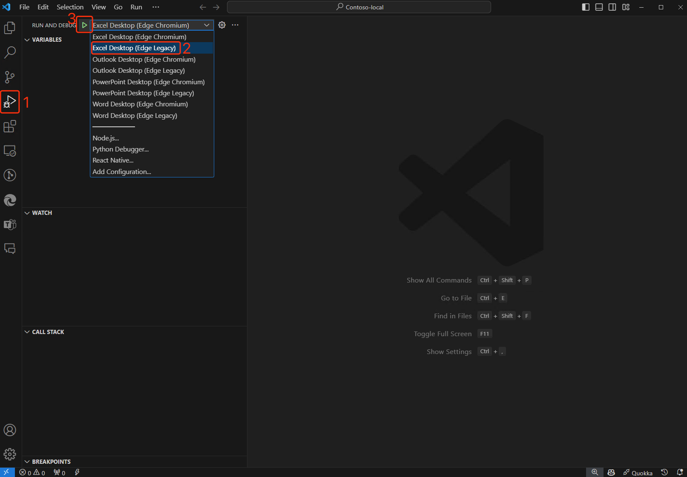

Once the Outlook app is open, select a mailbox item, and then you can use the Outlook add-in. For example, you can select the option to show a taskpane.


The taskpane should look as shown in the following image.
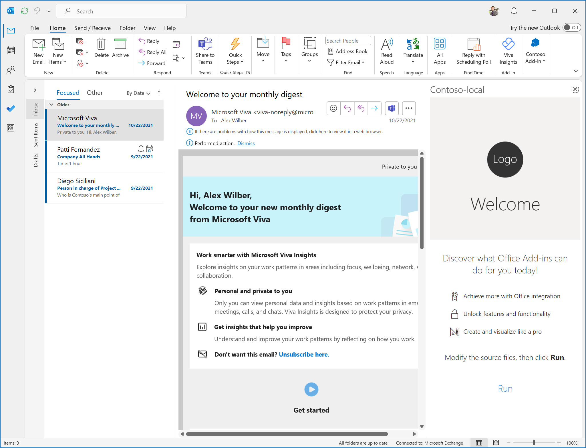

Once Excel is open, you can click the button to show your add-in list in flyout.
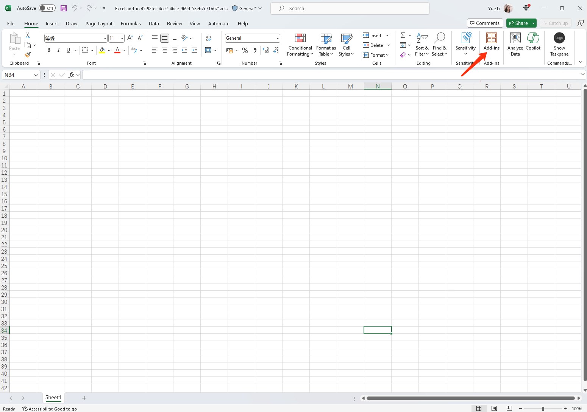

Find your add-in and click it, you will see the taskpane look as shown in the following image.
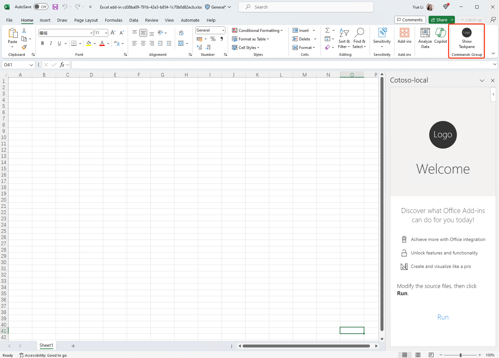


## Centralized deploy developed json manifest based Word, Excel and PowerPoint add-in to the users within your organization (tenant)
- Login Microsoft admin center with admin account.
- Explore to Settings\Integrated apps\Upload customer app\.
- Make sure choose "Teams app" under "App type", and upload your app package as a .zip file.  Learn more about the [app package](https://learn.microsoft.com/en-au/microsoftteams/platform/concepts/build-and-test/apps-package).  
- Select the user scope and deploy. Make sure the deployed users also enabled the new feature with register key setup.
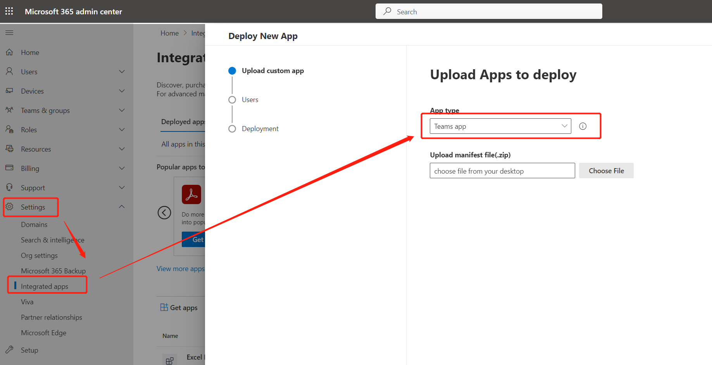

## Known issues

Now, these features are not support.
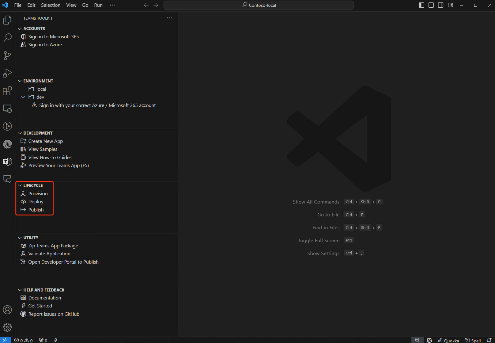


## Version History

|Date| Author| Comments|
|---|---|---|
|March 27, 2024| yueli2 | create sample|

## Feedback

We really appreciate your feedback! If you encounter any issue or error, please report issues to us following the [Supporting Guide](https://github.com/OfficeDev/TeamsFx-Samples/blob/dev/SUPPORT.md). Meanwhile you can make [recording](https://aka.ms/teamsfx-record) of your journey with our product, they really make the product better. Thank you!